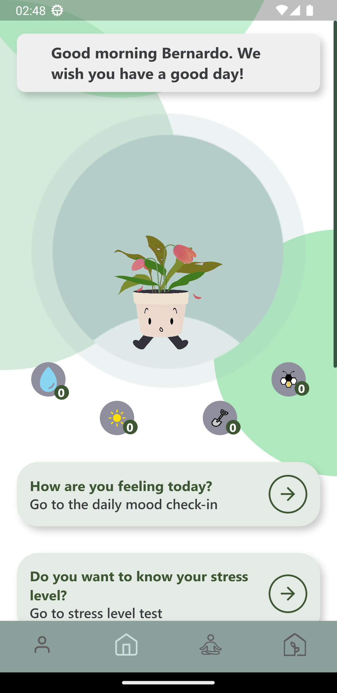
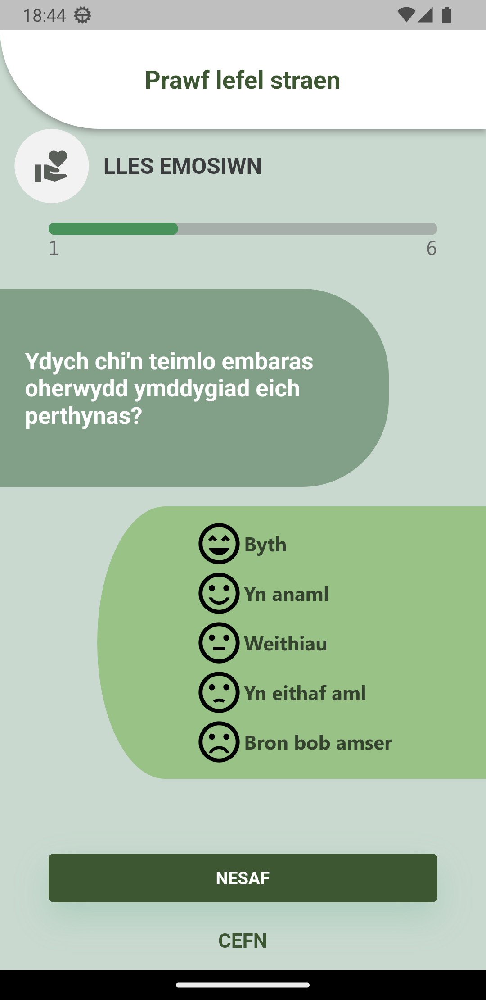
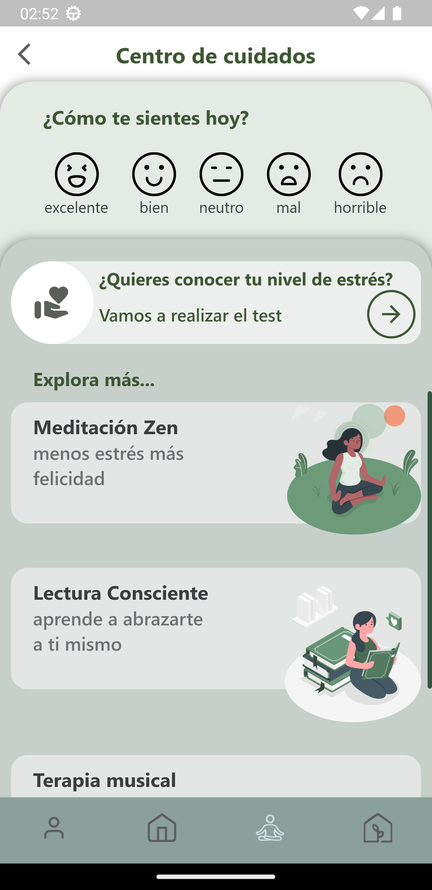
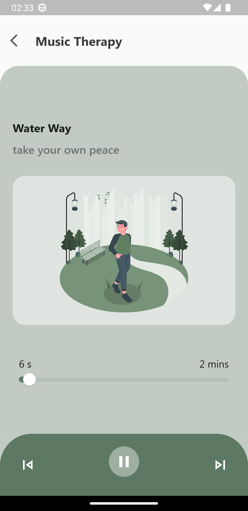
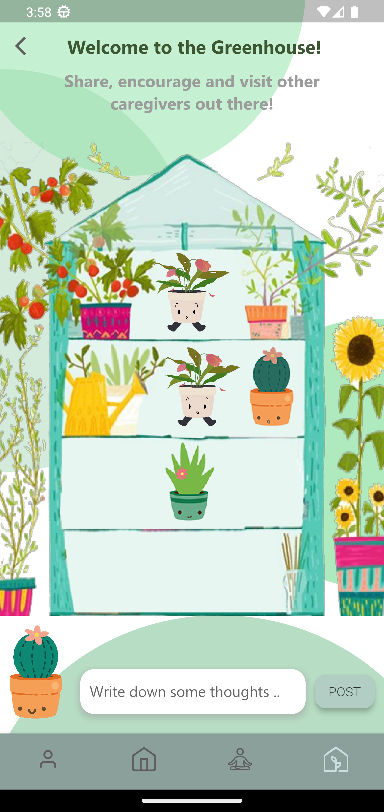
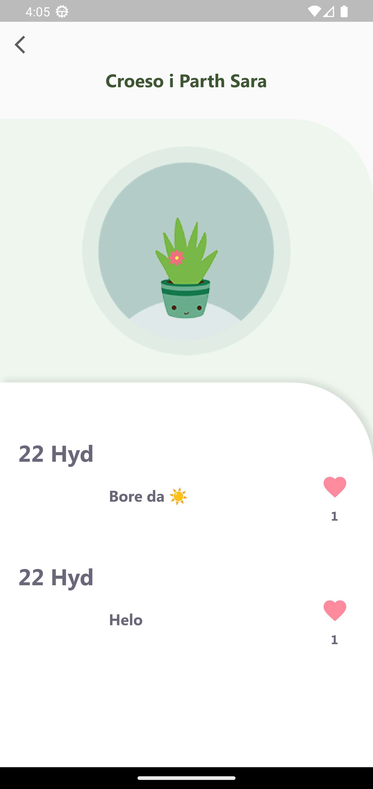

# Care4PlantApp

## Description:
Care4Plant is a multilingual mobile application developed to support the emotional well-being of informal caregivers. Unlike existing caregiver apps that focus primarily on patient-related tasks, Care4Plant centers entirely on the caregiver. It uses a virtual plant metaphor to represent users' stress levels and emotional states. The application encourages self-care through mood tracking, guided activities, and community interaction, and is currently available in Spanish, English, and Welsh. A two-week preliminary study involving nine users indicated high usability and user engagement, particularly through the plant-based metaphor and personalized well-being recommendations.

## Main Features

- **Multilingual Interface**: Available in English, Spanish, and Welsh.

- **Virtual Plant**: Represents the caregiver’s emotional state and evolves based on user interaction.

<div align="center">
  
</div>

- **Stress Level Test**: Short test based on the Zarit Burden Interview (ZBI) to assess caregiver stress.

<div align="center">
  
</div>

- **Care Center**: Offers relaxing activities and guided content (e.g., music, mindful texts).

<div align="center">
  
  
</div>

- **Greenhouse (Community)**: Optional space to anonymously share reflections with other users.

<div align="center">
  
  
</div>


---
## *Care4PlantApp* is composed of:

- *Frontend*: Mobile application developed in Flutter.
- *Backend*: RESTful API developed in ASP.NET Core, responsible for managing authentication, users, and activities.

## Technologies:

| Tool / Language | Purpose |
|-----------------|---------|
| Dart 3.0.0 | Cross-platform mobile logic |
| Flutter 3.10.0 | UI framework for Android/iOS |
| .NET 7 / C# 11 | Backend services |
| PostgreSQL 15 | Database |
| Entity Framework Core | ORM |
| Android Studio | Emulator + Android builds |
| Visual Studio 2022 | Backend development |

## Mobile App Architecture

Care4Plant adopts a **Clean Architecture** approach, organized by layers: `core`, `data`, `domain`, and `presentation`. This structure promotes modularity, testability, and separation of concerns.


``` text

lib/
├── core/ # Shared utilities, constants, and environment
├── data/ # Data sources and repositories (API, persistence)
│ ├── models/ # DTOs and backend-facing entities
│ ├── repositories/ # Implementations of domain repositories
│ └── source/ # API services, database access
├── domain/ # Core business logic (pure Dart)
│ ├── entities/ # Domain entities (e.g. Plant, StressTest)
│ ├── repositories/ # Abstract contracts
│ └── usecases/ # Application use cases
├── l10n/ # Localization files (.arb for en, es, cy)
├── ui/ # User interface (screens, widgets)
│ ├── models/ # View models or UI-bound models
│ ├── provider/ # State management (Provider, Riverpod, etc.)
│ └── views/ # Screens and widgets
├── injection_container.dart # Service locator / dependency injection
├── env.dart # Environment configuration
└── main.dart # Application entry point

```

---

## Build Instructions:

### Frontend (Flutter)


```bash
# Clone the repository from GitHub
git clone https://github.com/Bernardo-f/Care4Plant-App.git

# Navigate to the backend folder to run the API (required for app functionality)
cd server
dotnet run  # Starts the ASP.NET Core backend API

# Go to the Flutter app directory
cd Care4Plant-App/app

# Install Flutter dependencies
flutter pub get

# Build the Android APK (can be installed on any Android device)
flutter build apk
```

### Backend (.NET)

```bash
# Clone the repository
git clone https://github.com/Bernardo-f/Care4Plant-App.git
cd server

# Restore dependencies
dotnet restore

# (Optional) Create a local configuration file if needed
# e.g., appsettings.Development.json with your PostgreSQL connection string

# Apply existing EF Core migrations to create or update the database
dotnet ef database update

# Run the backend API
dotnet run

